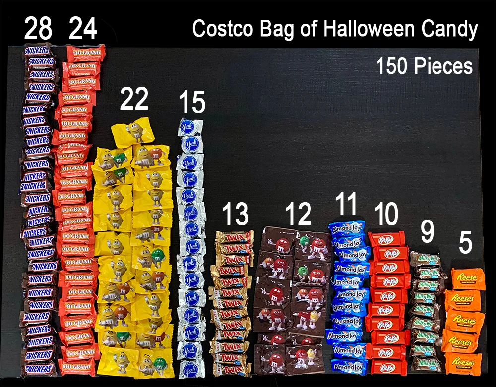
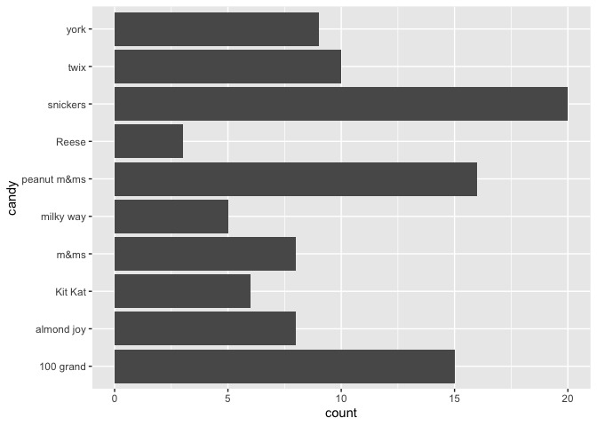

# Lab 9


## Creating an R Package Overview

- This lab will extend functions to create an R package. First we will
  do a quick demo and create your first R package.

- A comprehensive overview (free online book) about creating R packages
  is available here: [R Packages](http://r-pkgs.had.co.nz)

## Demo Overview:

1.  Create an R package
2.  Add R function to the R package
3.  Load and check
4.  Code Description
5.  R Oxygen documentation
6.  Check and Install

## 1. Create a new package using `devtools::create_package()`

Use a path inside the `create_package()` function or set the working
directly to where you’d like the function files to live.

``` r
library(devtools)
create_package('STAT408')
```

Note this will actually create a bundle of files known as an R project
and likely open that project in a new R studio window. That R project
will contain the following files and directories (as well as a few
others you can ignore):

- DESCRIPTION provides metadata about your package. This will be editted
  during the lab.
- NAMESPACE declares the functions your package exports for external use
  and the external functions your package imports from other packages.
  At this point, it is empty, except for a comment declaring that this
  is a file you should not edit by hand.
- The R/ directory is the “business end” of your package. It will soon
  contain .R files with function definitions.
- Lab9.Rproj (or similar name) is the file that makes this directory an
  RStudio Project.

## 2. Add R function to the R package.

We are going to add your candy function from Tuesday into the R package.
This will require working inside your R Insert your candy function from
Tuesday. This is a two step process:

- Write the function. For now don’t include it in your R project window,
  just here.

``` r
get_candy <- function(num_candy){
  # A function to randomly select candy from a bag consisting of Reeses, Snickers, M&Ms, and Kit Kats
  # Args: num_candy - the number of candy pieces to select
  # Returns: vector of candy bar names with length equal to num_candy
  if(!is.numeric(num_candy)) {
    stop('Please enter a numeric value for number of candy')
  }
  if(num_candy > 5){
    warning("Sugar Rush! Are you sure you want to do that?")
  }
  return(sample(c("Reese's", "Snickers", "m&ms", "Kit Kats"), num_candy, replace = T))
}
```

- In your R project window, use the function with `use_r()`

``` r
use_r("get_candy")
```

This will create an R file with the specified name.

- Open the R file, (you can navigate through the files tab) and add the
  R code to the file.

## 3. Test function with `load_all()` and `check()`

- Use `load_all()` for a quick test it the function will work. Make sure
  that the function you are accessing is from the package and not the
  global enviroinment:
  `exists("get_candy", where = globalenv(), inherits = FALSE)`

- Then run `check()` to verify that the package has all the necessary
  parts to load.

## 4. Code Description

- Update the code description file

- specify a license `use_mit_license()`

## 5. Documentation

- Open your R file, do Code \> Insert roxygen skeleton. A very special
  comment should appear above your function, in which each line begins
  with \#’.

- After updating your text, run `document()` which will pull in the
  documentation

## 6. check() & install()

- Finally, `check()` and `install()` will activate your package.

- You can now run `libary(STAT408)` to use your package.

------------------------------------------------------------------------

### Question 1 (3 points)

Show that you can load the R package and run the `get_candy` function.

``` r
library(STAT408)
```


    Attaching package: 'STAT408'

    The following object is masked _by_ '.GlobalEnv':

        get_candy

``` r
get_candy(5)
```

    [1] "m&ms"     "m&ms"     "Reese's"  "Snickers" "Kit Kats"

### Question 2 (2 points)

What happens when you type `?get_candy` into the console?

### Question 3 (5 points)

Let’s assume now that the number of pieces from each candy type are not
equal. Use this image  to identify the candy types and
candy amounts in the candy basket.

Write a function to draw candy from this basket. Use at least one
tidyverse funtion inside your function, such as `tibble` or `sample_n`

``` r
library(tidyverse)
```

    ── Attaching core tidyverse packages ──────────────────────── tidyverse 2.0.0 ──
    ✔ dplyr     1.1.4     ✔ readr     2.1.5
    ✔ forcats   1.0.0     ✔ stringr   1.5.1
    ✔ ggplot2   3.5.1     ✔ tibble    3.2.1
    ✔ lubridate 1.9.3     ✔ tidyr     1.3.1
    ✔ purrr     1.0.2     
    ── Conflicts ────────────────────────────────────────── tidyverse_conflicts() ──
    ✖ dplyr::filter() masks stats::filter()
    ✖ dplyr::lag()    masks stats::lag()
    ℹ Use the conflicted package (<http://conflicted.r-lib.org/>) to force all conflicts to become errors

``` r
trickRtreat <- function(how_many){
  candybasket <- tibble::tibble(type = c(rep('snickers', 28), rep('100 grand', 24),
                          rep('peanut m&ms', 22), rep('york', 15),
                          rep('twix', 13), rep('m&ms', 12),
                          rep('almond joy', 11), rep('Kit Kat', 10),
                          rep('milky way', 9), rep('Reese', 5)))
  return(candybasket |> sample_n(how_many) |> pull())
}
trickRtreat(4)
```

    [1] "york"     "Kit Kat"  "snickers" "snickers"

### Question 4 (5 points)

Add this new function to your R package. Note to use other functions
inside your function, you’ll need to do two things:

1.  run `use_package('dplyr')` or similar to identify the package the
    functions comes from

2.  refer to functions with the following convention `dplyr::sample_n()`

Re-install your package and run your function here. Make sure you are
accessing the version of the function from the package using the same
convention by calling `STAT408::trickRtreat(4)`

``` r
STAT408::trickRtreat(4)
```

### Question 5 (5 points)

We’ve not talked formally about pie charts in this class, but they
should be avoided. Pie charts make it very difficult to compare
different categories (something much easier to do with bar charts).

Use your trickRtreat function and sample 100 candies. Then create a bar
chart to show the outcome.

``` r
tibble(candy = STAT408::trickRtreat(100)) |>
  ggplot(aes(y = candy)) +
  geom_bar()
```


